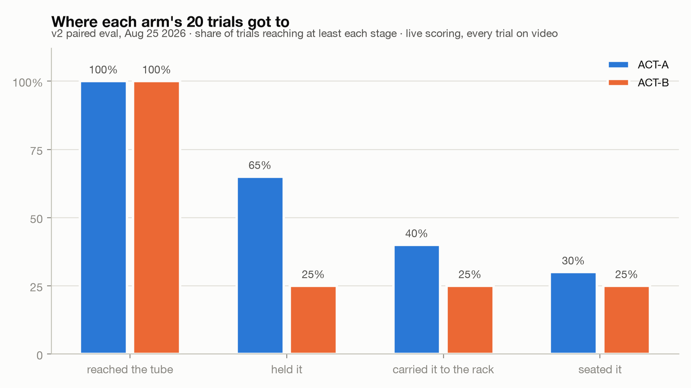
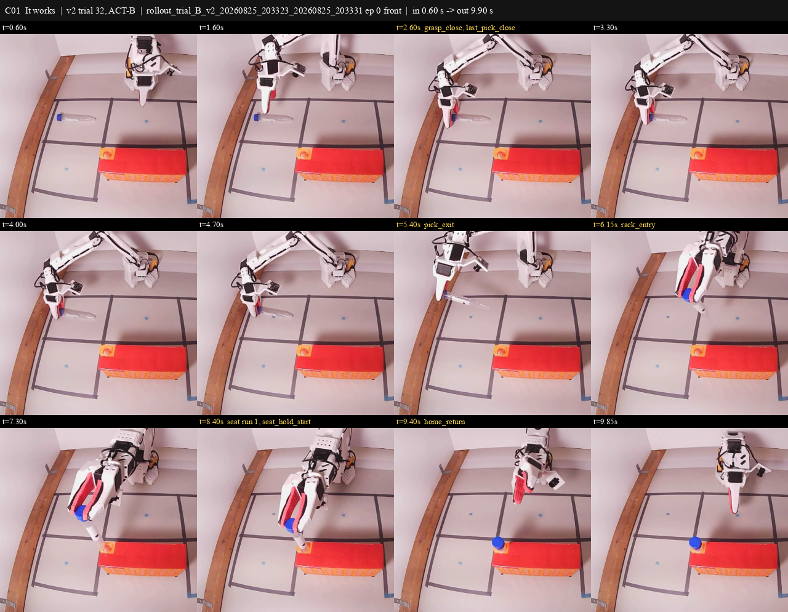
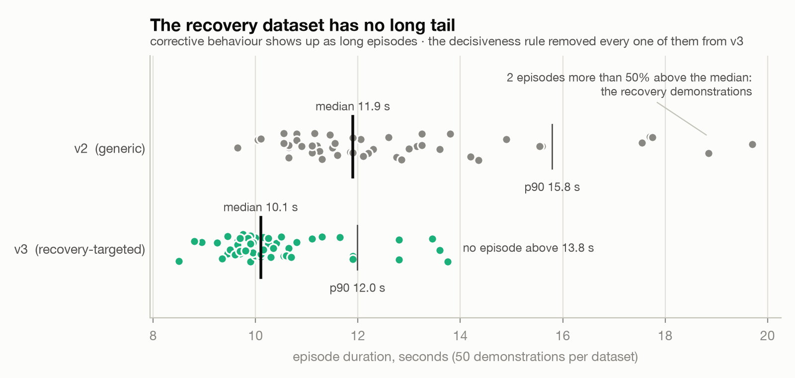

# so101-tube-insertion

**Does giving an imitation policy the servos' own load and current readings help it put a test tube into a rack, on a $300 3D-printed arm?**

This is the record of one summer's attempt to answer that on real hardware: a paired A/B evaluation, the pre-registered protocol that followed it, the failure taxonomy, the things I believed and then measured to be false, and the tooling that made any of the numbers believable.

**Status (2026-10-07).** The completed evaluation is v2 (Aug 25, 2026): 40 paired trials of ACT with and without the load channels. A larger pre-registered study (v4) was frozen on Sep 6. Its bench stopped on Sep 17 after a two-pair pilot, when the worn elbow could no longer be certified. On Sep 22 I decided to close the study at the pilot. The key is still sealed. The pilot, the unsealed key and the protocol text will follow as a dated addendum.

**The v2 result, in the only form the data support.** With 20 paired trials per arm, we can rule out an improvement from adding load and current larger than about 25 percentage points at 95%. ACT-A (vision and joint positions) seated 6 of 20. ACT-B (the same plus 6 load and 6 current channels) seated 5 of 20. Three pairs went A's way and two went B's.

**Demo video (41 s).** [Watch it on the releases page](https://github.com/FaithQin/so101-tube-insertion/releases). One run that works, one that recovers at the rack, and the three ways it fails. The frame-by-frame audit of every clip is in [`analysis/demo_cut/EDL.md`](analysis/demo_cut/EDL.md).

**Where things are.** The record documents sit at the top level (the v2 and v3 trial sheets, the v2 pre-registration, the start schedules, the literature notes). Code is in [`tools/`](tools/), the regression suite in [`tests/`](tests/), offline evidence in [`analysis/`](analysis/). [`PROVENANCE.md`](PROVENANCE.md) says how this snapshot was made. The datasets and checkpoints on the Hugging Face Hub stay private until the addendum.

---

## 1. The question and the null

I wanted to know whether an imitation policy gets better at a contact-rich insertion when it can read how hard its own motors are working. Every servo on this arm reports its load and current. ACT-A never sees those numbers. ACT-B sees them for all six joints, so its state is 18 numbers instead of 6. That is the only thing I changed. Both policies trained on the same 49 demonstrations, on the same rig, for the same task.

The task is to pick up a 50 mL test tube from a marked spot and stand it in a fixed rack. I count a trial as a success when the tube is standing in the hole, unsupported, at the end of the episode.

I pre-registered v2 on Aug 24 as 80 paired trials. The plan was a success rate per arm, Clopper-Pearson intervals and McNemar's test on the matched pairs. I stopped at 40. I made that futility call after looking at the data, so the stop was post hoc. The v4 protocol later added a rule against exactly that.

| arm | seated | 95% interval (Clopper-Pearson) |
|---|---:|---|
| ACT-A, positions only | 6 of 20 | 11.9% to 54.3% |
| ACT-B, positions + load + current | 5 of 20 | 8.7% to 49.1% |

Three discordant pairs went A's way and two went B's. On a 3 to 2 split, the exact version of the pre-registered McNemar's test gives p = 1.00. The mid-p version, which I chose for the later studies, gives 0.69.

The bound I quote is unpaired. It comes from an interval on the gap between the two arms' success rates. Put plainly, I can rule out an improvement from adding load and current larger than about 25 percentage points at 95%. A paired Newcombe interval on the same 20 pairs is tighter and gives about 17 points. I report the wider one. Either way the interval is wide, because twenty trials per arm is a small number.

The stage letters in the v2 sheet are live scores I gave as each trial ran. The pre-registration made a second pass from video the ground truth, and that pass never ran.

Where the trials did teach me something is in where things went wrong. 27 of the 29 failures ended before the tube reached the rack. Eighteen never grasped the tube, six slipped out of the jaws, two pecked at it, two jammed at the rack, and one was a slip or a miss that the video pass would have decided. ACT-A failed 14 times. In 7 of those it got a hold on the tube and still failed, and I scored 5 of those holds as marginal. ACT-B rarely held the tube. Thirteen of its 15 failures never held it at all. This describes twenty live-scored trials per arm, so I'm treating it as a lead for the next study and nothing more.

## 2. What it took to believe any number

**Replay as arbiter.** A deterministic replay of a known-good demonstration separates the plant from the policy. Without it, "my imitation policy is bad" can't be falsified on a $300 arm. From Aug 23 a replay had to seat before every block, and from Sep 1 no trial counted without a passing replay on the same power cycle. The replay caught an elbow fault on Aug 29, certified the plant on Sep 3 after two days with no seat, and on Sep 6 it stopped seating on its own, which is how the worn elbow gearbox in section 4 was found.

**Gates that abort in code.** On Aug 29 an hour of bench time went to checks that only printed a warning. Since then, if a condition should stop a launch it stops it in code, and if it shouldn't, it isn't in the launcher. Thresholds live in [`tools/preflight.py`](tools/preflight.py), [`tools/home_gate.py`](tools/home_gate.py) and [`tools/cert_gate.py`](tools/cert_gate.py).

| gate | threshold | born from |
|---|---|---|
| tube placement | within 8 px of the reference frame | an episode ran at 10.2 px because the number was printed and never enforced |
| home pose | each joint within mean ± 1σ of the training set's frame 0 (v4 elbow 85.61 ± 2.74°) | the elbow homed at 74.1°, below the v2 training floor, and a replay sailed past the tube |
| joint temperature | every joint at or below 60 °C, and an unreadable temperature refuses | a 69 °C elbow brownout, then a 68 °C wrist that an elbow-only gate let through |
| start state | frame 0 must not show the cap already seated | an episode began seated and was reset seven seconds into recording |
| telemetry | sidecar rows equal recorded frames, all six load channels live | one training episode had frozen load columns |
| pair parity | both halves of a pair run the same action-chunk setting | the v4 protocol |
| checkout | scored trials run from the main checkout only | a probe ran on a stale copy of the tools |

**Scoring from video.** v2 pre-registered two passes, live and then from video, with video as ground truth. The video pass never ran. From Aug 29 [`tools/score_episode.py`](tools/score_episode.py) scores each episode's own recording, reports "seat runs" and flags an episode that starts seated. A seat run is a count of frames with the cap inside a box on the image, and it can be wrong. On one probe the arm reaches the funnel and cannot insert, and every "seat run" the scorer counted was the dropped tube lying beside the rack or the operator's hand during resets. The evidence sheet is [`analysis/demo_cut/B2V-A-02_seat_runs_evidence.png`](analysis/demo_cut/B2V-A-02_seat_runs_evidence.png). v4 scores offline, hashed and shuffled, with a blinded 20% re-score at 48 hours and a weighted kappa gate of 0.75.

**Pre-registration, in order.**

- v2 (Aug 24): success rate with Clopper-Pearson intervals and McNemar, two-pass scoring. Stopped at 40 of 80.
- Priming confirmation (Aug 27): criterion 8 of 10. Result 5 of 10, not confirmed.
- v3 (Aug 29): 40 pairs plus a 20-trial chunk-lock arm, fixed n, mid-p McNemar. Abandoned on a floor effect before any scored trial.
- v4 (Sep 6): frozen before trial 1. The forbidden sentences and the power table were written before the data. SHA-256 of the frozen text: `e4011b90100d4014dba47148528162a23debaec6198b8980248c1a2fdfe2cca7`. Current text with its dated amendments: `8ed49730af16814c78d5a6bcc2c2c967e32f1becac7bc4ed3d28a351de63a0a9`. The text is published with the addendum.

**Plumbing that looked like policy.** Eight times something looked like a model result and was infrastructure. The transferable line: on a physical rig, the prior on "the model is bad" should be much lower than it feels.

| # | looked like | actually was | cost |
|---|---|---|---|
| 1 | the policy re-records or skips episodes | mouse-wheel scroll became arrow-key escape sequences in a raw-mode terminal | every probe before Aug 22 shredded into 2 to 17 s fragments |
| 2 | a 12 to 15 Hz control loop | the log printed 1/dt for each single overrunning tick | a wrong headline for a day |
| 3 | a failing elbow servo | homing backlash: one command landed 1.5° apart by approach direction | the spare-servo question, reopened on Sep 6 when real wear was measured |
| 4 | the policy starts out of distribution | the follower's connect call moved wrist roll 1.62°, repeatable to 0.09° | early v3 probes started out of distribution before the shift was found |
| 5 | (would have been) π0.5 can't do the task | load and current routed into state dimensions the model had trained as zeros | none, the rollout path was read before it ran |
| 6 | (would have been) bf16 is broken on Apple Metal | a blanket dtype cast in the benchmark | none, a second device disagreed |
| 7 | the elbow and wrist horns slipped about 10° | a leader-vs-follower delta with no pre-fault baseline, patched into the servos | a bench evening, a 69 °C wrist, six configurations and zero seats, then withdrawn |
| 8 | a two-day plant fault | the diagnostics normalised joints to a ±100 range while production used degrees | two days. The instruments measured their own unit gap and called it a fault |

A delta without a baseline is not evidence of change. Cases 7 and 8 are the expensive class.

**Believed, then falsified.**

| believed | tested how | outcome |
|---|---|---|
| a start-state mismatch explains ACT-A's failures | perturb one observation dimension offline, diff the predicted chunk | dead: at most 0.04° of action change, the policy is vision-dominated |
| a good previous trial primes the next one | pre-registered 10-cycle confirmation, blind camera scoring | not confirmed, 5 of 10 against a criterion of 8 |
| the control loop runs at 12 to 15 Hz | log timestamps over 60 s | never existed: 1156 frames in 60 s is 19.3 Hz |
| the elbow servo is failing (Aug 29) | direction-dependent homing measurement | a backlash bug, then real gearbox wear on Sep 6 |
| locking the action chunk during the grasp helps | 5 trials on, 5 off, with engagement logging | not demonstrated: 5 of 5 vs 3 of 5, Fisher p 0.44 |
| bf16 is broken on Apple Metal | the same code on CUDA | my own bug |
| the elbow and wrist horns slipped 10° and 7° | hard-stop encoder sweep against the Aug 7 calibration | withdrawn: every stop within 1.6° |
| a changed EEPROM register explains the elbow's 3° settle error | every register on all six servos, side by side | dead: configuration identical |
| the Aug 31 to Sep 2 plant fault was mechanical | cheapest test first, each with a baseline | mostly the instruments (case 8) plus a cold first pass |
| π0.5 and SmolVLA had measured control rates | tried to source both | never measured. ACT's 19.62 Hz is the only clocked rate |
| the B policies ignore the 12 extra channels | input ablation on held-out frames | dead: ACT-B's chunk moves 1.56 times more for load and current than for positions |
| π0.5-B predicts contact-frame actions better | the same test at the pre-declared checkpoints, three seeds | did not survive: a difference of 0.002 ± 0.005 |
| the VLAs' grasp pose is within 1σ of training, so "rode too high" is unsupported | compared against what reaches the tube today | retracted: a 6.4° elbow gap |

**The regression suite.** Every bug that cost bench time became a test the same day, and a green test proves nothing until a mutation makes it red. The suite started at 32 tests on Aug 29, and `pytest --collect-only -q tests/` prints how many this snapshot holds. You can't run all of it. The tests that read this rig's calibration, the cached datasets or the patched site-packages skip or fail elsewhere, and the tests that pin the sealed key are held back until the addendum.

## 3. The recovery data that taught the wrong thing

For v3 I recorded 50 new demonstrations. Thirty were ordinary takes. The other 20 targeted failure states I had measured on the bench. In ten of them the tube started rotated, and in five it started nudged off its mark. I set the tube in those states by hand before each take. In the last five the tube started on its mark, and I copied the policy's hover left of the cap before correcting onto it.

So only 15 episodes started in a staged bad state, and in those the arm never saw how the tube got there. That transition is the moment where a policy would learn to notice that something went wrong.

The recording rule also said every take had to be decisive, and I redid any take that felt hesitant. A recovery is a hesitation followed by a correction. My own rule removed the behaviour the dataset was meant to capture. You can see it in the durations, because episodes with a correction in them run long. v2 has a median of 11.9 s and two long recovery episodes. v3 has a median of 10.1 s and no long episodes at all.

What I should have done is let the policy make the mistake and record only my correction, which is what DAgger does. I wrote a single-arm before-and-after design for it in [the DAgger design document](<Eval Design %E2%80%94 DAgger single-arm before-after.md>), and I never ran it.

Once the plant was verified, I ran 2 probe trials per arm on v3. The A policy grasped the tube both times and failed to insert it both times. The B policy didn't grasp it in either trial. That fits the v2 split, and two trials per arm can't say more than that. No v3 trial was ever scored under its pre-registration.

This is a finding about how I curated the data. For v4 I changed the recording rules so that the arm itself creates every bad state during the episode. I don't have a bench comparison of the two approaches yet.

## 4. What the arm cannot know about itself

**Thermal sag.** A cold follower executes the same absolute-position commands about 1 cm higher than a warm one, enough to miss every grasp of a 30 mm tube. Position feedback reports the servo's own belief. Two warm-up replays before every block are part of the protocol because of this.

**Backlash.** One home command landed 1.5° apart depending on the direction it arrived from.

**The elbow's 3° offset.** The elbow settles about 3.07° from its command at both anchors measured, folded and extended, under opposite gravity loading. Configuration, calibration and every EEPROM register were checked and identical. It stays an open reading.

**Positional accuracy under gravity, from the first week.** A position error of about 19 raw counts produces too little torque to break static friction, so a joint commanded to creep forward freezes and looks exactly like an obstruction. An error of about 7 counts falls inside the servos' deadband. Gravity-loaded joints need about 8 units of lead and stop about 6 short of a raised target. On this arm, positional accuracy under load is several degrees no matter how good the policy is.

**The measurement trap.** The arm fills a large part of the fixed camera's frame and can't return to the same pose twice because of the settle error. A stroke that touched nothing once scored 58,150 changed pixels of "movement", 6.3% of the frame, because the arm ended somewhere else. Three early "successes" were the arm, the operator sitting in frame, and a real replay misread as a failed push. The rule that came out of it: capture before and after with the arm parked out of the object's region, and read the bounding box of what changed, because the bounding box says what moved.

**The worn elbow gearbox (Sep 6).** Replaying a v4 episode's exact commands, the loaded end-effector proxy sat at −5.15° against −3.11° while recording, and three replays agreed to a hundredth of a degree. Voltage, fault flags, gains, limits, temperature, calibration and warm-up were ruled out by measurement. Commanding 4.9° further bought 0.44° of travel while load rose from 168 to 368. With torque off the joint moves in bumps, one per gear tooth. Homing now approaches the elbow from above, which compensates for the wear but leaves the gearbox worn. Open-loop replay no longer seats. A closed-loop policy still can, because it sees the wrist camera at 20 Hz and corrects for being low. Both arms of the study run on the same plant, so the paired contrast survives. The absolute success rates are depressed.

**A thermal budget nobody watched.** Holding the home pose with torque on for 25 minutes of software work, the wrist flex servo went from 45 to 68 °C at a steady load of 260, one degree under the brownout, while the gate read only the elbow. Every joint is gated now.

**What the load channels actually carry.** The gripper's load reading saturates at 500, its torque limit, so contact force is right-censored exactly when it matters. Offline, on held-out frames, freezing the load and current channels at their training mean moved the predicted chunk more in contact frames than in free frames, by about 15% for ACT-B and SmolVLA-B and about 40% for π0.5-B (ACT-B 3.20° against 2.79°, SmolVLA-B 7.46° against 6.47°, π0.5-B 6.95° against 4.97°). A "contact frame" here is one where a distal load reading sits far from its training mean. That's a threshold on load, and no contact in those frames was verified. Freezing the position channels instead moved ACT-B's chunk 1.85°, so ACT-B leans on load and current 1.56 times more than on positions. The reading is that the B policies use the channels as a state signature spread across every frame (which episode, which phase, how warm), and the pre-registered contact anchor, an onset in distal load, never fires inside a training rack window. The confound is named before a reviewer names it: robomimic's section 4.3 found that adding low-dimensional information the task doesn't need cost image-based agents 2 to 29% in relative performance, and B adds 12 dimensions to A's 6.

## 5. Re-planning window, chunk lock, π0.5 on a laptop

**The re-planning window.** ACT predicts a chunk of actions and executes some of them before predicting again. I tried four settings. The 10 and 100 points ran on the first ACT-A policy, before v2 existed and before the arrow-key fix in section 2, and the other two ran on ACT-A-v2. Executing 10 actions per chunk collapsed motion (5 to 24 units of joint travel in 42 s, the arm trembling in place). Temporal ensembling with a forward pass every tick reached the tube, closed partway, then hovered for 35 s. Executing 25 was bimodal, a success or a peck loop. Executing 100 overshot blind. At 25 the peck is locked to chunk boundaries: the lift joint moved 6.35° per tick at boundary ticks against 0.87° elsewhere, and five episodes in a row produced 66, 67, 67, 67 and 67 lift reversals, two per chunk.

**The symptom's name.** "Woodpecker" comes from Sherry Chen's SO-101 ACT post on the Hugging Face blog. Her diagnosis list, paraphrased: cameras that moved between training and evaluation, a camera angle that hid the grasp, a redone calibration, a handful of positions memorised, no evaluation set, and watching the follower while recording. Here the scene and camera are pinned by the placement gate, the calibration by EEPROM readback, and the position is single by design. Not controlled in v2 or v3: no evaluation set until v4, and neither camera angle nor operator gaze was addressed. So the chunk-boundary reading is a candidate cause for a symptom with several, and I'm not claiming more.

**Chunk lock.** Denying re-planning during a closing onset: 5 of 5 seated with the lock on against 3 of 5 off, Fisher p 0.44. Not demonstrated. The lock extended a chunk in only 3 of the 5 on-trials, both off-failures fell at cold moments, and after 17:43 everything seated regardless. It is off in v4.

**π0.5 on a laptop.** A 50-action chunk is 2.5 s of robot time at 20 Hz, so the budget is 2.5 s per forward pass. On an M5 Pro's Metal backend the fine-tuned π0.5 predicts a chunk in 0.678 s at p90. A rented RTX 3090 does it in 0.338 s. Both fit with more than three times headroom, so a 2.3 B parameter model runs the loop on the laptop. That measurement is a forward pass on synthetic observations, so it is a latency and says nothing about the control rate. Offline, the same policy reproduces demonstrated actions with a normalised error of 0.035 against 0.099 for copying the current position.

**On the arm.** π0.5-A on v3: 0 of 3 valid probes, the tube never moved, every trial a peck. SmolVLA-A on the same data displaced the tube about 4 cm once, the first contact by a non-ACT policy. Across all 12 v3 probes, one pre-grasp jaw close separated carrying from pecking: every trial that carried the tube closed once before the grasp, every trial that didn't closed 6 to 23 times. On v4 data SmolVLA overfit by 5,000 steps in both arms, with all eight held-out episodes worse at 20,000.

**Control rates.** ACT measured 19.62 Hz on the bench (873 frames in 44.44 s). No clocked rate exists for the VLAs. Compute per tick over every scored log: ACT 8.8 ms, SmolVLA 18.5 ms, π0.5 35.8 ms against a 50 ms tick, with the deficit at each chunk boundary, about 0.7 s for SmolVLA and 1.0 s for π0.5.

**Costs.** The v1 ACT pair about $28. π0.5-A on v3, 30,000 steps, about $26. The five v4 runs about $34.50.

## 6. Five falsifiable bets and the honest gap

These are the five bets I'd carry into a next study. For each one I say where it stands today and what would prove me wrong. None of them has won outright.

**1. On a cheap rig, a bad-looking policy is usually the plant or the instrument.** My evidence is the eight cases in section 2. Status: open. v2 lost only 1 trial in 41 to infrastructure, so "usually" may only hold before a rig has a harness. I'm wrong if failures that pass the full audit (a seating replay, live telemetry and every gate) turn out to be policy failures nearly every time.

**2. Demonstrations that start in a staged bad state teach a policy to handle that state, and on-policy corrections teach it to recover from its own mistakes.** Status: untested on the arm. v3 has no long tail, which tells me the staged takes held no corrections to learn from (section 3). I designed a DAgger test for the second half of this bet and never ran it. I'm wrong if a DAgger policy does no better than one trained on a matched batch of extra staged episodes, or if a v4 policy corrects a displacement it caused no more often than a v3 policy.

**3. Effort channels can't help a policy that never reaches contact, and an A/B that starts with the tube already grasped is the version that could show an effect.** 27 of the 29 v2 failures ended before the rack, so most trials never got to the phase where load could matter. Status: untested where it counts. The pre-grasped condition never ran, because the unit mismatch from case 8 in section 2 made the homing script refuse the carry pose. The pre-registered load-based contact detector caught 0 of 4 deliberate rack contacts in the demonstrations, and offline the B policies used load about as much in free space as near contact (section 4). I'm wrong if B does better than A at the grasp stage, before the tube reaches the rack. I'm also wrong if, on pre-grasped pairs, B gets no further than A and the interval rules out the gain I care about.

**4. Chunked behaviour cloning has a narrow re-planning window, and committing to a chunk works better than averaging over many.** Status: open and thin. Two of the four points in section 5 ran on the first policy. Temporal ensembling got two episodes at one setting. The most direct test, the chunk lock, gave 5 of 5 against 3 of 5 with Fisher p 0.44. I'm wrong if, on one v4 policy with paired starts, executing 50 actions per chunk or ensembling at another setting gets as far on graded stage as executing 25.

**5. A laptop has enough compute to run a VLA, and the obstacles are data and evaluation.** π0.5 predicts a 50-action chunk in 0.678 s at p90 against a 2.5 s budget. That number comes from a forward pass on synthetic inputs, though. Status: partly lost. On the arm, π0.5-A went 0 of 3 on v3 and never moved the tube. I had predicted it would fail at the same stage as ACT-A, which grasped and then couldn't insert. It failed earlier. Latency also caused one real failure mode. SmolVLA hovered when a real-time chunking queue dropped its leading actions on the laptop, and switching to synchronous inference removed that fault. I'm wrong if the same π0.5 checkpoint, on the same starts at GPU latency, gets further than it did on the laptop, or if a wall-clocked laptop rollout shows pauses at chunk boundaries.

**The honest gap.**

- No v4 A/B result exists. The bench stopped on Sep 17 after a two-pair pilot, and the key is still sealed.
- The v2 null is wide. With twenty trials per arm I can rule out an improvement larger than about 25 percentage points at 95% with an unpaired interval (about 17 with a paired one), and nothing smaller.
- v2's stage letters are live scores. The video pass never ran.
- n is small everywhere. v2: 20 per arm. v3: 2 per arm on the verified plant. v4: a two-pair pilot.
- One position, one task, one rig. There is no spatial generalisation claim here.
- The plant degraded mid-study. The worn elbow depresses absolute rates. The pairing protects the contrast.
- One training seed per cell.
- Offline, the B policies used load about as much in free space as near contact, which looks like a state signature. The pre-registered contact anchor doesn't appear in the demonstrations' rack windows.
- Across-day variance is large. The same v2-A policy went 8 of 10 on Aug 29 (five of them with the chunk lock on) and 6 of 20 on Aug 25.
- The arm isn't useful today.

**Positioning.** FACTR 2 (arXiv:2606.12406) is the closest neighbour: raw motor current, ACT, insertion. I designed v4 with FACTR 2 in view, as a low-cost replication attempt on a $300 arm with servo telemetry instead of joint-torque hardware. v4 has no A/B result. Phaser (arXiv:2605.29407) puts force sensors on a deformable task, mostly in a failure detector, and no ablation there isolates the force channel. robomimic section 4.3 is the confound both of those and this one carry.

---

## Below the fold

### The scoring taxonomy

Two axes per trial, pre-registered on Aug 24 and 25 before the first trial was scored. Definitions are in the v2 sheet.

| stage reached | meaning |
|---|---|
| R | reached: the jaws entered the grasp zone, about one cap width from the tube |
| G | grasped: the tube held in closed jaws and lifted off the mat |
| T | transported: carried into the rack area |
| Rel | released: let go into or over the funnel |
| S | seated: standing in the hole, unsupported, at episode end |

| failure mechanism | meaning |
|---|---|
| NG | never grasped: misses without the peck loop, including a touch or nudge where the tube was never held |
| PECK | three or more descend-and-withdraw cycles without a grasp, for the rest of the episode |
| SLIP | the tube leaves the jaws during the grasp or lift, still at the pick site |
| DT | the tube leaves the jaws during transport |
| JAM | insertion fails after rack contact, including drops caused by contact |
| KR | the rack or tube knocked over as the primary event |
| INFRA | infrastructure corrupted the trial (camera dropout, servo fault, harness error), logged and re-run |

### v2, 40 trials, live scoring

| arm | S | T | G | R | NG | PECK | SLIP | JAM |
|---|---:|---:|---:|---:|---:|---:|---:|---:|
| ACT-A | 6 | 2 | 5 | 7 | 6 | 1 | 5 | 2 |
| ACT-B | 5 | 0 | 0 | 15 | 12 | 1 | 1 (+1 undecided) | 0 |

Stage columns count the furthest stage reached, and mechanism columns count failures. One ACT-B trial was ruled "SLIP or NG, video decides" and the video pass was never recorded. The full sheet with every trial's notes is [the v2 trial sheet](<Eval Trials %E2%80%94 v2 paired blocks.md>).

### Reproducibility kit

- **The four site-packages patches** on upstream LeRobot 0.6.1 that the study depends on: [`tools/so_follower_load.patch`](tools/so_follower_load.patch) reads Present_Load and Present_Current on all six joints into the observation (18-dimensional state) and adds gripper stall protection. [`tools/sync_queue_skip_patch.py.txt`](tools/sync_queue_skip_patch.py.txt) skips per-tick preprocessing while ACT serves from its action queue. [`tools/rollout_context_load_state_patch.txt`](tools/rollout_context_load_state_patch.txt) and [`tools/rollout_context_state_routing_patch.txt`](tools/rollout_context_state_routing_patch.txt) route the extra channels into the state a policy expects. Episodes recorded without the first patch can never be retrofitted.
- **Training configs** for the six v4 policies in [`tools/train_configs/v4/`](tools/train_configs/v4/), the dataset manifest [`tools/v4_manifest.json`](tools/v4_manifest.json) and the split in [`tools/v4_training_split.py`](tools/v4_training_split.py).
- **Hold-out verdicts** in [`analysis/v4_holdout/`](analysis/v4_holdout/). The checkpoint each policy would run on the bench was fixed by a pre-declared rule from these curves: ACT-A and ACT-B at 40,000 steps, π0.5-A at 20,000, π0.5-B at 15,000, SmolVLA-A and SmolVLA-B at 5,000.
- **Offline evidence**: input ablations in [`analysis/v4_ablation/`](analysis/v4_ablation/), contact-frame loss comparisons in [`analysis/v4_contact_loss/`](analysis/v4_contact_loss/), π0.5 latency in [`analysis/pi05/`](analysis/pi05/), the elbow anchors in [`analysis/anchor_results.json`](analysis/anchor_results.json).
- **Datasets and checkpoints** live on the Hugging Face Hub and stay private until the addendum.

### Hardware

A 3D-printed SO-ARM101 pair, leader and follower, with Feetech HX-30HM servos on the follower and HX-10HM on the leader, 12 V 5 A per arm. Two USB cameras: a fixed front camera at 1280×720 and a wrist camera at 640×480, both recorded at 20 fps. A Mac laptop runs teleoperation, recording and inference on Apple's Metal backend. Training ran on rented H200 GPUs through Hugging Face Jobs. The arm cost about $300.

### Tests

`pytest tests/` from the repo root with the LeRobot environment active. Expect skips and failures for anything that reads this rig's calibration, the cached datasets, the patched site-packages, or a file held back from this snapshot. [`TESTING.md`](TESTING.md) lists what each test file pins and the bench-time bug it came from.

### License

Apache-2.0. Snapshot of the private working repository at commit `5ff8ab9`. See [`PROVENANCE.md`](PROVENANCE.md).
